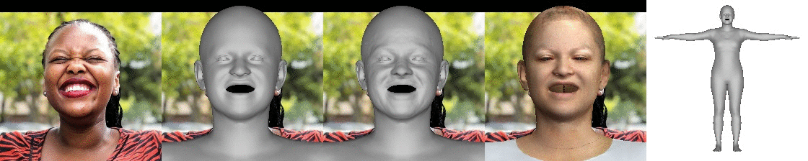
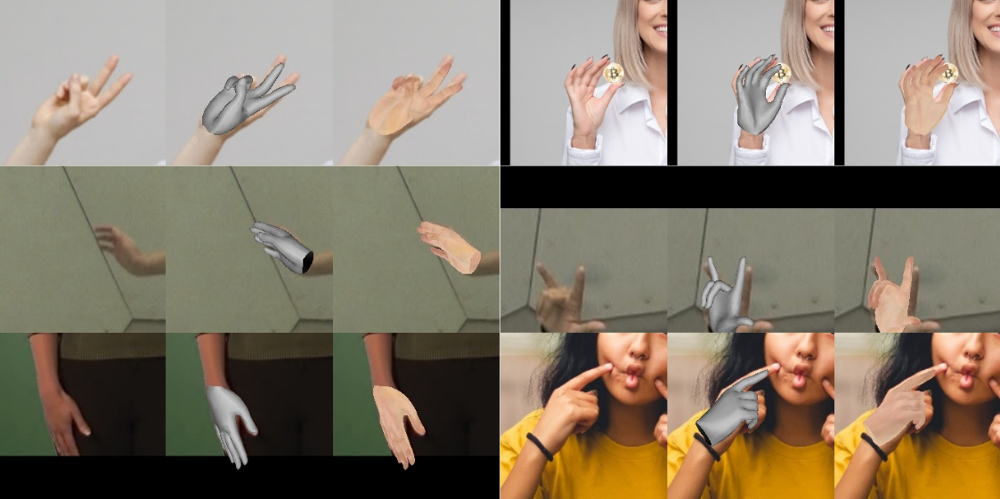

# PIXIE: Collaborative Regression of Expressive Bodies

<!-- []() -->

[[Project Page](https://pixie.is.tue.mpg.de/)] 
<!-- [[Supp. Mat.]()] -->


<p align="center"> 

</p>
<p align="center"><p align="center">

This is the official Pytorch implementation of PIXIE. 

PIXIE reconstructs an expressive body with detailed face shape and hand articulation from a single image.
PIXIE does this by regressing the body, face and hands directly from image pixels using a neural network that includes a novel moderator, which attends to add weights information about the different body parts.
Unlike prior work, PIXIE estimates bodies with a gender-appropriate shape but does so in a *gender neutral* shape space to accommodate non-binary shapes. 
Please refer to the [Paper](https://ps.is.mpg.de/uploads_file/attachment/attachment/667/PIXIE_3DV_CR.pdf) for more details.

The main features of PIXIE are:

* **Expressive body estimation:** Given a single image, PIXIE reconstructs the 3D body shape and pose, hand articulation and facial expression as SMPL-X parameters 
* **Facial details:** PIXIE extracts detailed face shape, including wrinkles, using [DECA](https://github.com/YadiraF/DECA)
* **Facial texture:** PIXIE also returns a estimate of the albedo of the subject
* **Animation:** The estimated body can be re-posed and animated
* **Robust:** Tested on full-body images in unconstrained conditions. The moderation strategy 
prevents unnatural poses. Overall, our method is robust to: various poses, illumination conditions and occlusions
* **Accurate:** state-of-the-art expressive body reconstruction
* **Fast:** this is a direct regression method (pixels in, SMPL-X out)
<!-- 
## Table of Contents
  * [Getting started](#getting-started)
    * [Requirements](#requirements)
    * [Pre-trained model and data](#pre-trained-model-and-data)
  * [Demo](#demo)
    * [Expressive 3D body reconstruction](#expressive-3d-body-reconstruction)
    * [3D face reconstruction](#3d-face-reconstruction)
    * [3D hand reconstruction](#3d-hand-reconstruction)
    * [Animation](#animation)
  * [Citation](#citation)
  * [License](#license)
  * [Acknowledgments](#acknowledgments)
  * [Contact](#contact) -->

## Getting started
Please follow the [installation instructions](Doc/docs/getting_started.md) to
install all necessary packages and download the data.

## Demo
#### Expressive 3D body reconstruction
```bash
python demos/demo_fit_body.py --saveObj True 
``` 
This return the estimated 3D body geometry with texture, in the form of an
obj file, and render it from multiple viewpoints. 
If you set the optional `--deca_path` argument then the result will also contain facial details from [DECA](https://github.com/YadiraF/DECA),
provided that the face moderator is confident enough.
Please run `python demos/demo_fit_body.py --help` for a more detailed
description of the various available options. 

<!-- <p align="center">    -->
<!--  -->
<!-- </p>     -->
<!-- <p align="center">    -->
<!--  -->
<!-- </p>   -->
<p align="center">   

<!--  -->
</p>  
<p align="center">   

<!--  -->
</p>  
<p align="center">   

<!--  -->
</p> 
<p align="center">   

<!--  -->
</p>  
<!-- <p align="center">   

</p>    -->
<!-- You can also generate an obj file (which can be opened with Meshlab) that includes facial textures. -->
<p align="center">input body image, estimated 3D body, with facial details, with texture, different views<p align="center">


#### 3D face reconstruction
```bash
python demos/demo_fit_face.py --saveObj True --showBody True
```   
Note that, given only a face image, our method still regresses the full SMPL-X parameters, producing a body mesh (as shown in the rightmost image). Futher, note how different face shapes produce different body shapes.  The face tells us a lot about the body.

<p align="center">   

</p>  
<p align="center">input face image, estimated face, with facial details, with texture, whole body in T-pose<p align="center">

#### 3D hand reconstruction
```bash
python demos/demo_fit_hand.py --saveObj True
```   
We do not provide support for hand detection, please make sure that to pass
hand-only images and flip horizontally all left hands. 

<p align="center">   

</p>  
<p align="center">input hand image, estimated hand, with texture(fixed texture).<p align="center">

#### Animation
```bash
python demos/demo_animate_body.py 
``` 
Bodies estimated by PIXIE are easily animated.  For example, we can estimate the body from one image and animate with the poses regressed from a different image sequence.  
 
The visualization contains the input image, the predicted expressive 3D body, the animation result, the reference video and its corresponding reconstruction. For the latter, the color of the hands and head represents the confidence of the corresponding moderators. A lighter color means that PIXIE trusts more the information of the body image rather than the parts, which can happen when a person is facing away from the camera for example.  

<p align="center">   

</p>  
<!-- <p align="center">   

</p>   -->
<!-- <p align="center">input image, predicted expressive 3D body, the animation result, the reference video and -->
<!-- its corresponding reconstruction. <p align="center"> -->

<!-- ## Qualitative Comparison to other methods -->

## Notes

You can find more details on our method, as well as a discussion of the
limitations of PIXIE [here](Doc/docs/notes.md).

<!-- ## Todo
- [ ] online demo (that given a single image, view the estimated smplx mesh and download it as obj file)
- [ ] training code  -->

## Citation
If you find our work useful to your research, please consider citing:
```
@inproceedings{PIXIE:2021,
      title={Collaborative Regression of Expressive Bodies using Moderation}, 
      author={Yao Feng and Vasileios Choutas and Timo Bolkart and Dimitrios Tzionas and Michael J. Black},
      booktitle={International Conference on 3D Vision (3DV)},
      year={2021}
}
```

## License
This code and model are available for non-commercial scientific research purposes as defined in the [LICENSE](https://github.com/YadiraF/PIXIE/blob/master/LICENSE) file.
By downloading and using the code and model you agree to the terms in the [LICENSE](https://github.com/YadiraF/PIXIE/blob/master/LICENSE). 

## Acknowledgments
For functions or scripts that are based on external sources, we acknowledge the origin individually in each file.  
Here are some great resources we benefit from:  
- [ExPose](https://github.com/vchoutas/expose)  
- [SMPL-X](https://github.com/vchoutas/smplx) for the SMPL-X model  
- [Pytorch3D](https://pytorch3d.org/), [neural_renderer](https://github.com/daniilidis-group/neural_renderer), [SoftRas](https://github.com/ShichenLiu/SoftRas) for rendering  
- [kornia](https://github.com/kornia/kornia) for cropping
- [faster-rcnns](https://pytorch.org/docs/stable/torchvision/models.html#faster-r-cnn) for person detection
- [face-alignment](https://github.com/1adrianb/face-alignment) for face cropping   

We would also like to thank the authors of other public body regression methods, which allow us to easily perform quantitative and qualitative comparisons:  
[HMR](https://github.com/akanazawa/hmr), [SPIN](https://github.com/nkolot/SPIN), [frankmocap](https://github.com/facebookresearch/frankmocap)

Last but not least, we thank Victoria Fernández Abrevaya, Yinghao Huang and Radek Danecek for their
helpful comments and proof reading, and Yuliang Xiu for his help in capturing
demo sequences. This research was partially supported by the Max Planck ETH Center for Learning Systems.
Some of the images used in the qualitative examples come from [pexels.com](https://www.pexels.com).

## Contact
For questions, please contact [pixie@tue.mpg.de](mailto:pixie@tue.mpg.de).   
For commercial licensing (and all related questions for business applications), please contact [ps-licensing@tue.mpg.de](mailto:ps-licensing@tue.mpg.de).
